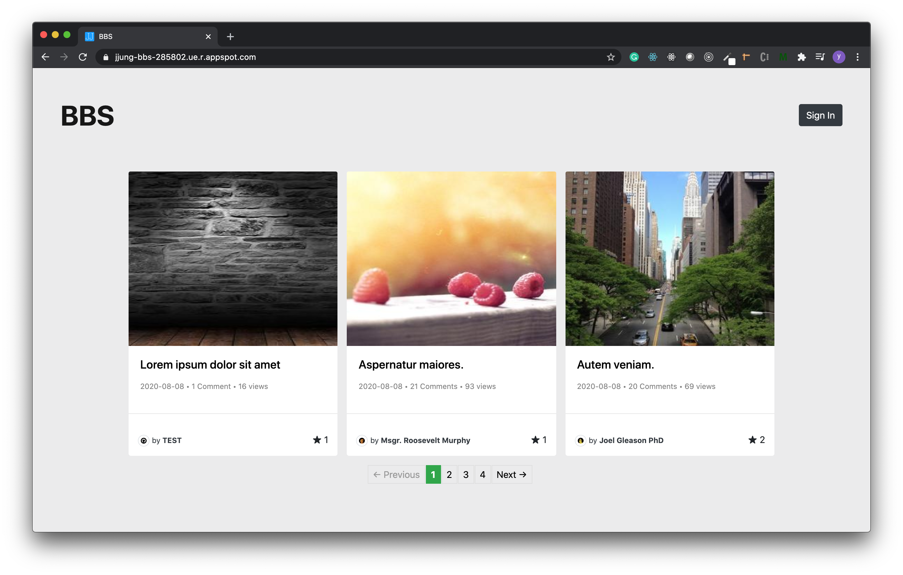

# bbs

This is a simple bulletin board system which is built using Ruby on Rails and Google Cloud Platform (GCP)

## Table of contents
- [Demo](#demo)
- [Documentation](#documentation)

## Demo
<https://jjung-bbs-285802.ue.r.appspot.com/>  

## Documentation

### Tach Stack
#### Front
- HTML
- SASS
- JavaScript
- Fontawesome
- Bootstrap
- ERB (Rails Template)

#### Back
- Ruby on Rails
- Google Cloud Platform (App Engine, Database, GCS)

#### Database
- PostgreSQL

### Function
* User Authentification
* Create / Read / Update / Delete post 
* Create / Read / Update / Delete comment
* Set / Unset like of each post
* Possible to upload and play videos or images on posts
* Filtering

